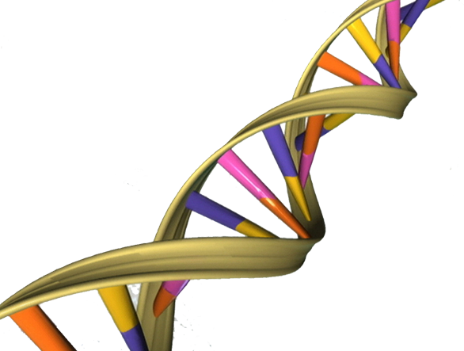
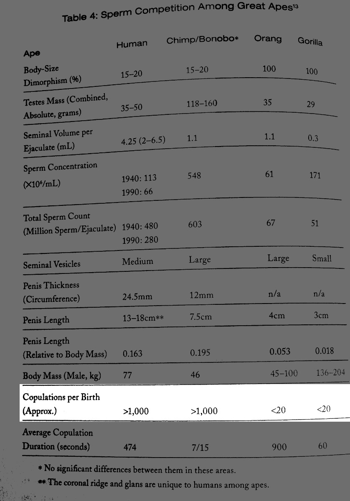

:title: A beginner's guide to all the stupid shit going on in higher education
:data-transition-duration: 800

:css: css/presentation.css

.. title:: Stupid Shit in Higher Ed

----

:data-y: 0
:data-x: -100000
:data-scale: 10

What is *Higher Education*, Really?
===================================

.. note::
    Back after 10 years
    Ready to talk some history
    Let's not fetishize the past
    Incredible sophistication
    Campus seems to be doing well.

----

:data-x: 0
:data-y: 0
:data-scale: 10
:id: beginning

Let's Start at
==============

the beginning.
==============

----

:data-scale: .01
:data-x: -2
:data-y: -2
:data-z: 0
:id: invent-universe

"If you wish to make apple pie from scratch, you must first invent the universe." 
---------------------------------------------------------------------------------

-- Carl Sagan
-------------

----

:data-x: 0
:data-y: 0
:data-scale: .6
:id: radical-symbol

.. image:: img/radical-symbol.png

----

:data-x: 0
:data-y: 0
:data-z: 0
:data-scale: 40
:data-rotate-y: 0
:id: beginning-again

----

:data-x: -15000
:data-y: -10000
:data-scale: 40
:class: grid-slide
:id: human-condition

The Human
=========

Condition
=========

----

:data-x: r-1700
:data-y: r750
:data-scale: 1

Catching up on the past 15 million years
========================================

.. note::
    A story of coming down from the trees

----

:data-x: r0
:data-y: r50
:class: appear

15 million years ago - Hominids appear
======================================

.. note::
    family which included ancestors of today's humans, chimpanzees, gorillas, and orangutans

----

:data-x: r0
:data-y: r50
:class: appear

2.5 million (or so) years ago - humans
======================================

.. note::
    something like anatomically current humans

----

:data-x: r0
:data-y: r50
:class: appear

60k years ago - agriculture
===========================

.. note::
    Possibly the beginning of the state, possibly the beginning of mongamy as a social norm

----

:data-x: r0
:data-y: r50
:class: appear

300 years ago - industry
========================

----

:data-x: r0
:data-y: r50
:class: appear

unfolding now: the internet
===========================

----

:data-x: r1250
:data-y: r0

:id: human-reproduction

Human Reproduction
===================

----

:data-x: r-200
:data-y: r200
:data-scale: 1
:class: appear
:id: human-reproduction-helix

Genetic
=======

----

:data-x: r0
:data-y: r350
:class: appear disappear
:id: conception

.. image:: img/Conception.png

.. note:: Sex is actually a social behavior

----

:data-x: r0
:data-y: r0
:id: diversity-sex
:class: appear

.. image:: img/diversity-sex.png

----

:data-x: r250
:data-y: r350
:data-scale: .5
:class: appear sex-stats
:id: sex-stats

.. image:: img/sexual-stats.jpg
    :height: 700px

----

:data-x: r0
:data-y: r0
:class: appear sex-stats
:id: sex-stats-mask

----

:data-x: r150
:data-y: r-820
:data-scale: 1
:class: appear

Memetic
=======

.. note::

    One consequence of human evolution into the internet is that reproduction is both genetic and memetic.

    Previously: genetic heritance available to individuals, memetic heritance to societies.

----

:data-x: r0
:data-y: r150
:class: appear disappear

.. image:: img/cc-logo.png

----

:data-x: r0
:data-y: r0
:id: lol-years-whole
:class: appear disappear

.. image:: img/lol-year-by-year.jpg
    :height: 700px

----

:id: bt-swarm
:class: appear disappear

.. image:: img/bittorrent-swarm.png
    :width: 400px

----

:class: appear

----

:data-x: r0
:data-y: r300
:data-scale: 1.8
:class: appear disappear

???
===

----

:data-x: r0
:data-y: r0
:class: appear
:id: education-memetic-text

"Education"
===========

.. note ::
    No social norm of monogamy surrounding memetic reproduction
    Nobody needs to tell us to do it; it comes instinctually

----

:data-x: -15000
:data-y: -10000
:data-scale: 40
:id: pre-zoom-back-to-definition

----

:data-x: -100000
:data-y: 0
:data-scale: 10
:id: back-to-definition

----

:data-x: r0
:data-y: r1500
:id: first-definition
:class: appear

Education (n.):
===============

(1) The reproductive conduit for memetic evolution
==================================================

(2) A social bonding behavior
=============================

.. note::

	Genetic inheritance happens through sex, but crucial to the human species is that sex is primarily a social behavior, and only secondarily a reproductive behavior.

	Similarly, education is a primarily social behavior, but is the reproductive conduit for memetic evolution.

    Education is to memetic evolution as sex is to genetic evolution

    We have a special, distinct architypical place for this social gathering

----

:data-x: 0
:data-y: -10000
:data-scale: 40
:class: grid-slide
:id: the-campus

The Campus
==========

----

:data-x: r-1700
:data-y: r750
:data-scale: 1

Ancient Campuses
================

----

:data-x: r1250
:data-y: r0

.. image:: img/Raphael_School_of_Athens.jpg
    :width: 700px

.. note::
    Painted by Rafael in 1500's
    Platonic Academcy (later as Aristotle's Lyceum) lasted about 900 years, from the 300's BC until the 500's AD.

----

.. image:: img/Nalanda_University_India_ruins.jpg
    :width: 700px

Nalanda
=======

.. note::
    ancient center of higher learning in Bihar, India from 427 to 1197
    eight separate compounds, ten temples, meditation halls, classrooms, lakes and parks, ten story library

----

:data-x: r0
:data-y: r0
:class: under-caption appear disappear

10,000 Students
===============

----

:class: under-caption appear disappear

2,000 member faculty
====================

----

:class: under-caption appear disappear

Open to the public
==================

----

:class: appear

.. image:: img/nalanda-map.jpg

----

:data-x: r1250

.. image:: img/sather_gate_night.png
    :width: 800px

.. note::
    Sather Gate, Berkeley

----

:class: circle

Students
========

----

:data-x: r200
:data-y: r330
:class: circle appear

Faculty
========

----

:data-x: r-400
:data-y: r0
:class: circle appear

Staff
=====

----

:data-x: r200
:data-y: r-180

----

:data-x: r0
:data-y: r0
:class: appear half-screen

:id: has-institutional-memory

Institutional Memory
====================

----

:data-x: r0
:data-y: r0
:class: appear half-screen

:id: has-collective-amnesia

Collective Amnesia
==================

.. note::
    Students - unique among the powers the powers in higher ed, suffer from collective amnesia.
    One school of thought - staff exists to remedy this so that students can come and go

----

:data-x: r1250
:data-y: r0

Student Government
==================

.. note::
    Called many things: Student Union in Eur and LA, SGA, SA, etc.
    Historical impact: Yearbook, newspaper, campus magazines, meeting minutes, radio, television
    More material of historical note than rest of campus - not to discount amazing research!
    About as big as government can comfortably be
    What's SUNY Student Government budget?

----

:data-x: r0
:data-y: r50
:class: appear

Leverages Passion
=================

.. note::
    This is something we share with the faculty.  Bang for buck.

----

:data-x: r0
:data-y: r100
:class: appear
:id: student-government-budget

* Typical Student Government budget: $2.5 million
* (We'll call this number a "Student Government Equivalent, or SGE).

.. note::
    Err on the side of over-estimation

----

:data-x: 15000
:data-y: -10000
:data-scale: 40
:class: grid-slide
:id: the-state

The State
=========

----

:data-x: r1250
:data-y: r0
:data-scale: 1

What is the State?
==================

.. note::
    Not genetic except for a few monarchistic royal families
    Entered our memetic lineage ("meme pool") between 60 and 6k years ago

----

:data-x: r0
:data-y: r100
:class: appear

.. note::

	The State is a memetic virus, with distinct operating norms, that seeks to copy its likeness into the operating systems of people, cultures, and especially institutions.

	The transmission vectors for this virus generally end in the suffix “-ism.”  By far, the two most popular and effective are sexism and racism.

----

:data-x: r1000
:data-y: r0

Why do we have the State?
=========================

.. image:: img/ladder-trees.jpg

.. note::
    Once served a useful purpose

----

The "monolith" critique
=======================

.. note::
    ...is not the same thing as the existence of discrete 'governments' which claim sovereignty over various parts of the earth.

    When pointing out predictable, typical patterns of state activity, people sometimes counter by saying, “but it's not like this in Germany!  Or Costa Rica!”

    Nobody is saying that *governments* all behave the same.

    But in the presence of an autocratic world state, it's reasonable to expect that *hegemonic* governments and their “allies” (perhaps pawns) will most transparently enact statist domestic policy.

----

Predictable state behavior patterns
===================================

----

:data-x: r0
:data-y: r50
:class: appear

"Jobification"
--------------

.. note::
    Fetishes jobs in the extreme
    Good ideas thwarted by the state threatening someone's job
    Politicians creating jobs?
    Jobs, generally speaking, are on the way out
    Going to college to get a job is like going on a cruise to learn how to play the accordion

----

:data-x: r-125
:data-y: r0
:data-scale: .05

.. image:: img/fb-17-purpose-life-650px.jpg

----

:data-x: r125
:data-scale: 1

----

:data-x: r0
:data-y: r50
:class: appear

Makes it personal
=================

.. note::
    Makes bureaucrats feel personally invested so that discussions about the wisdom of the existence of departments and offices is perceived as a personal attack rather than a reasoned plan.
    If you want to take something away from the state, you are threatening someone's livelihood
    CAS - Steve and Christine
    No personal problem with anybody
    Dad Story
    (while we're on the topic, Mom's birthday)

----

:data-x: r-150
:data-y: r0
:data-scale: .05

.. image:: img/personally.png

----

:data-x: r150
:data-scale: 1

----

:data-x: r0
:data-y: r50
:class: appear

Confuses "law" with authority
=============================

.. note::
    Just because the state makes a law putting someone in charge of something doesn't mean that they are actually in charge of that thing.

----

:data-x: r-260
:data-y: r0
:data-scale: .05

----

:data-x: r260
:data-scale: 1

----

:data-x: r0
:data-y: r50
:class: appear

Spends recklessly
=================

----

:data-x: r-160
:data-y: r0
:data-scale: .05

.. image:: img/waste-planet.jpg
    :width: 800px

.. note::
    Not just money - environmental resources, people's lives, land
    Not just waste - drag.

----

:data-x: r160
:data-scale: 1

----

:data-x: 15000
:data-y: 0
:data-scale: 40
:class: grid-slide
:id: state-structures
:class: white-text

State Structures
================

----

:data-x: r-1700
:data-y: r750
:data-scale: 1
:id: doe
:class: white-text

The United States Department of Education
=========================================

----

:data-x: r0
:data-y: r100
:class: appear disappear
:id: doe-budget
:class: white-text

2012 Budget: $87.5 billion (35,000 SGE's)
-----------------------------------------

----

:data-y: r0
:class: appear disappear
:class: white-text

4,400 employees
---------------

----

:class: appear
:data-y: r250
:id: doe-orgchart

----

:data-x: r1500
:data-y: 750
:data-scale: 1
:id: suny
:class: disappear
:class: white-text

State Universities and Colleges
===============================

.. note:: UC, UMD, UConn

----

:data-x: r0
:data-y: r0
:class: appear
:class: white-text

SUNY
====

----

:data-x: r0
:data-y: r50
:class: white-text appear disappear

459,550 students
================

----

:data-x: r0
:data-y: r0
:class: white-text appear disappear

89,871 Employees
================

----

:class: white-text appear disappear

Non-faculty: 55,279 (74.2% FT)
==============================

----

:class: white-text appear disappear

Faculty: 34,024 (45.9% FT)
==========================

----

:class: white-text appear disappear
:data-y: r50

Direct Tax Support (2014): $1.7 billion
=======================================

Capital Plan (2014) $1.98 billion
=================================

(3.68 billion == 1,472 SGEs)
============================

.. note::

    It's not actually as straightforward as this, capital plan is actually a bond
    A hefty portion of the tax support funds SysAdmin in Albany and never makes it to a campus
    Is anybody tracking this?
    Convenient excuse

----

:class: white-text appear disappear
:data-y: r0

The student contribution
========================

(Warning: SUNY fuzzy math ahead)
================================

----

:class: appear

.. image:: img/suny-budget-request.png

----

:class: appear

----

:data-x: r1500
:class: appear white-text

From SUNY's "Smart Track" handbook
==================================

.. note:
    No source on how many total SUNY students live on campus.

----

:class: white-text

SUNY colleges: $20,130 x 219,759 Students = $4.4b
=================================================

Comm colleges: $15,000 x 239,791 Students = $3.59b
==================================================

----

:data-x: r0
:data-y: r70
:class: white-text appear

Total student contribution: $7.99b (3,196 SGE)
==============================================

.. note::
    With the current data available, it's not knowable how much of this is under state management.
    If this money is supplied by students, why does the state even have a vote?

----

:class: white-text appear

( + State contribution ($3.68b)) = $11.67b (4,668)
==================================================

----

:class: white-text appear

A student government for every 98.4 students
============================================

----

:class: white-text appear

Put another way: 79.8 student governments here.
===============================================

.. note::
    Just to be clear: not suggesting expanding SG by 79.8 times, but that it's possible to reduce state

----

:data-y: r800
:class: white-text

The next time the legislature threatens to cut SUNY
===================================================

----

:data-y: r80
:class: white-text appear

Let's tell them: Go ahead and do it.
====================================

----

:data-y: r80
:class: white-text appear

In fact, we already have a plan; sit back and relax.
====================================================

.. note:: Finding things to cut is not hard once you look at the organizational structure.

----

:data-x: r1000
:data-y: r0
:class: white-text
:id: board-of-trustees

SUNY Board of Trustees
======================

How it views itself:

"The Board of Trustees is the governing body of the State University of New York. It consists of 18 members, 15 of whom are appointed by the Governor, by and with consent of the New York State Senate. In addition, the president of the Student Assembly serves as student trustee and the presidents of the University Faculty Senate and Faculty Council of Community Colleges serve as ex-officio trustees."

----

:data-x: r0
:data-y: r0
:class: appear

.. image:: img/orgchart_15.png
    :width: 900px

----

:data-x: r200
:data-y: r-250
:data-scale: .2

.. note::
    President of staff
    SA President is President

----

:data-x: r-200
:data-y: r250
:data-scale: 1

----

:data-x: r-80
:data-y: r40
:data-scale: .2

.. note::
    ResLife political / police arm rather than service arm
    Anybody know anything?
    What does "political" mean
    Live in close quarters, homogenous living,

----

:data-x: r100
:data-y: r0
:data-scale: .01

(From Internet Access ToS)

The following activities are prohibited:
* Any mass mailings in support of political campaigning, advocacy, or endorsements (such as for national, state, local, or union offices or legislative changes)

----

:data-scale: .2
:data-x: r-100
:data-y: r-100

.. note::
   Campus judicial process
   Orientation
   SAUS

----

:data-x: r50
:data-y: r25
:data-scale: .01

.. image:: img/stamp.JPG
  :height: 800px

----

:data-x: r3
:data-y: r0
:data-scale: .002

----

:data-x: r-3
:data-y: r0
:data-scale: .01

----

:data-x: r-50
:data-y: r-25
:data-scale: 1

----

:data-x: r0
:data-y: r-1000
:class: white-text

Auxiliary Services Corporations
===============================

("CAS")
=======

.. note::
    Ostensibly independent, ostensibly not-for-profit
    Fails to insulate
    Spends on bad things
    Yet, good, passionate people who care

----

:data-x: 15000
:data-y: 10000
:data-scale: 40
:class: grid-slide
:id: campus-body-politic

The Campus
==========
Body Politic
============

----

:data-x: r-1700
:data-y: r750
:data-scale: 1
:class: circle appear

Students
========

----

:data-x: r200
:data-y: r330
:class: circle appear

Faculty
========

----

:data-x: r-400
:data-y: r0
:class: circle appear

Staff
=====

----

:data-x: r200
:data-y: r-180

----

:data-x: r0
:data-y: r0
:class: appear half-screen

:id: adults

Adults
======

----

:data-x: r0
:data-y: r0
:class: appear half-screen

:id: are-children

Children
========

----

:data-x: r0
:data-y: r0
:class: appear half-screen

:id: also-adults

----

:data-x: 15000
:data-y: 10000
:data-scale: 40
:id: next-pre-zoom-back-to-definition

----

:data-x: -100000
:data-y: 1500
:data-scale: 10
:id: next-back-to-definition

----

:data-x: r0
:data-y: r1800
:id: second-definition
:class: appear

*Higher* Education (n.):
========================

Education (see above) which leverages passion and involves adults.
==================================================================

